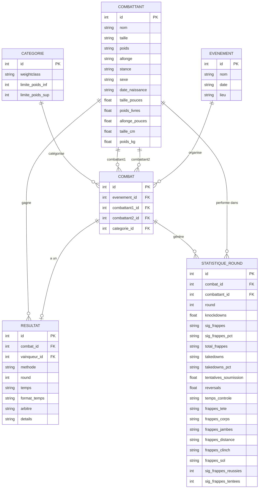

<h1 style="display: flex; align-items: center; gap: 10px;">
  
- Projet CS50 SQL
</h1>

## 📚 Contexte académique
> Ce projet a été réalisé dans le cadre de l'UE6 - Infrastructure de données (partie SQL) du Master 1 Analyse et Politique Economique, Parcours **Data science pour l'économie et l'entreprise du futur** (DS2E).

## 💡 Présentation du projet
Dans ce projet, nous avons construit un **système complet de gestion de données** autour de l'univers de l'UFC (Ultimate Fighting Championship), combinant à la fois :
- Les aspects sportifs (résultats, statistiques)
- Les données biométriques des athlètes
- Les informations événementielles

Notre travail consiste à **modéliser puis implémenter une base de données relationnelle SQL** qui retrace :
- Le parcours des combattants
- Leurs performances techniques
- Les événements majeurs de l'organisation
- Des données détaillées comme les statistiques par round, les méthodes de victoire et les caractéristiques physiques

Ce système permet non seulement d'**archiver les informations historiques** des combats UFC, mais aussi d'**effectuer des analyses statistiques avancées** sur les performances et les tendances de ce sport en pleine expansion.

## 📋 Table des matières
- [Objectifs du projet](#objectifs-du-projet)
- [Structure de la base de données](#structure-de-la-base-de-données)
- [Diagramme Entité-Relation](#diagramme-entité-relation)
- [Fonctionnalités principales](#fonctionnalités-principales)
- [Contenu des fichiers](#contenu-des-fichiers)
- [Installation et utilisation](#installation-et-utilisation)
- [Exemples de requêtes](#exemples-de-requêtes)
- [Sources des données](#sources-des-données)
- [Optimisations et limitations](#optimisations-et-limitations)

## 🎯 Objectifs du projet

L'objectif principal est de créer un système complet de gestion de données autour de l'UFC qui permet de :

- Stocker et gérer les informations sur les combattants (caractéristiques physiques, palmarès)
- Enregistrer les événements UFC et leur localisation
- Suivre les résultats détaillés des combats
- Analyser les statistiques de performance par round et par combattant
- Classifier les combattants par catégories de poids
- Fournir des vues analytiques pour les requêtes fréquentes

Ce projet vise également à appliquer concrètement les enseignements reçus lors de nos cours. Il représente une synthèse pratique de nos connaissances théoriques en SQL.

## 🏗️ Structure de la base de données

La base de données est structurée autour de six tables principales et trois vues optimisées :

### Tables principales
1. **CATEGORIE** - Catégories de poids des combattants
2. **COMBATTANT** - Informations sur les athlètes
3. **EVENEMENT** - Détails des événements UFC
4. **COMBAT** - Association entre événements et combattants
5. **RESULTAT** - Résultats des combats
6. **STATISTIQUE_ROUND** - Statistiques détaillées par round et par combattant

### Vues analytiques
1. **VUE_PALMARES** - Récapitulatif des victoires/défaites par combattant
2. **VUE_STATS_COMBATTANT** - Statistiques agrégées par combattant
3. **VUE_DETAILS_COMBAT** - Vue complète des combats avec leurs résultats

## 📊 Diagramme Entité-Relation

## ✨ Fonctionnalités principales

La base de données UFC offre les fonctionnalités suivantes :

- **Suivi complet des combattants** : Stockage des informations biométriques avec conversion automatique entre unités impériales (pouces, livres) et métriques (cm, kg)
- **Gestion des événements** : Organisation hiérarchique des événements avec date et lieu
- **Analyse détaillée des combats** : Statistiques complètes par round incluant frappes, takedowns, soumissions
- **Catégorisation automatique** : Association des combats aux catégories de poids appropriées
- **Vues prédéfinies** : Accès facile aux statistiques et résultats les plus recherchés
- **Optimisation des performances** : Index sur les colonnes fréquemment utilisées
- **Intégrité des données** : Triggers pour garantir la cohérence des données (ex: poids des combattants vs catégorie)

## 📁 Contenu des fichiers

Ce projet est composé des fichiers suivants :

- [**schema.sql**](schema.sql) : Script de création du schéma de la base de données
- [**import.sql**](import.sql) : Script d'importation des données depuis les fichiers CSV
- **queries.sql** : Exemples de requêtes démontrant les capacités de la base de données
- **README.md** : Ce document de conception et documentation

### Fichiers de données (format CSV) :

- [**catégories.csv**](CSV/catégories.csv) : Liste des catégories de poids UFC
- [**TOTT.csv**](CSV/TOTT.csv) : Données sur les combattants (TOTT = "Tale of the Tape", terme utilisé à l'UFC pour désigner les statistiques comparatives des combattants avant un combat)
- [**evenements.csv**](CSV/evenements.csv) : Liste des événements UFC
- [**combats.csv**](CSV/combats.csv) : Associations des combattants aux événements
- [**Résultats_combats.csv**](CSV/Résultats_combats.csv) : Résultats détaillés des combats
- [**Statistiques_combats.csv**](CSV/Statistiques_combats.csv) : Statistiques par round

## 📝 Exemples de requêtes

Notre base de données permet d'effectuer des analyses avancées sur les combats, combattants et statistiques de l'UFC. Vous trouverez dans le fichier [**queries.sql**](queries.sql) un ensemble complet de requêtes démontrant les capacités analytiques du système.

EXEMPLE REQUETE

## 📝 Exemples de requêtes

Notre base de données permet d'effectuer des analyses avancées sur les combats, combattants et statistiques de l'UFC. Vous trouverez dans le fichier [**queries.sql**](queries.sql) un ensemble complet de requêtes démontrant les capacités analytiques du système.

## 📝 Exemples de requêtes

Notre base de données permet d'effectuer des analyses avancées sur les combats, combattants et statistiques de l'UFC. Vous trouverez dans le fichier [**queries.sql**](queries.sql) un ensemble complet de requêtes démontrant les capacités analytiques du système.

**EXEMPLE DE 2/3 REQUETE CODE + RESULTAT**

### 4. Exemple d'insertion complète : UFC Strasbourg
Pour illustrer comment ajouter de nouvelles données, nous avons créé un exemple fictif d'événement UFC à Strasbourg comprenant :

- **L'événement** : "UFC Strasbourg" programmé le XX décembre 20XX
- **Les combattants** : Mélange de combattants locaux français (XX, XX, XX) et internationaux (XX, XX)
- **Trois combats** :
  - XX vs XX (Middleweight)
  - XX vs XX (Women's Flyweight)  
  - XX vs XX (Welterweight)
- **Les résultats détaillés** :
  - XX gagne par KO/TKO au round X
  - XX gagne par décision unanime
  - XX gagne par soumission au round X
- **Les statistiques par round** : Données détaillées incluant les frappes significatives, takedowns, knockdowns, et temps de contrôle pour chaque combattant à chaque round

Consultez le fichier [**queries.sql**](queries.sql) pour explorer toutes ces requêtes et comprendre comment tirer le meilleur parti de notre système de gestion de données UFC.

## 📊 Sources des données

Les données utilisées dans ce projet proviennent des sources suivantes :

- [Scrape UFC Stats – Greco1899](https://github.com/Greco1899/scrape_ufc_stats) : La majorité des données ont été récupérées grâce à ce script Python de scraping qui collecte les données depuis [UFCStats.com](http://ufcstats.com/)
- [UFC.com](https://www.ufc.com/) – Références officielles (catégories, poids, événements)

## 🔧 Optimisations et limitations

### Optimisations

- **Colonnes générées** : Utilisation de colonnes générées pour les calculs fréquents
- **Index stratégiques** : Index sur les jointures et conditions de filtrage courantes
- **Vues matérialisées** : Précalcul des agrégations courantes via des vues
- **Conversion d'unités** : Stockage à la fois des unités impériales et métriques
- **Triggers** : Validation automatique de la cohérence des données

### Limitations

- **Mises à jour en temps réel** : La base de données n'est pas conçue pour des mises à jour en direct pendant les événements
- **Normalisation vs performance** : Certaines tables, comme STATISTIQUE_ROUND, contiennent des données textuelles qui pourraient être davantage normalisées
- **Catégorisation automatique** : L'algorithme de correspondance des catégories de poids peut nécessiter des ajustements manuels dans certains cas
- **Données manquantes** : Certains combattants peuvent avoir des informations incomplètes (date de naissance, stance, etc.)
- **Correspondance des noms** : Des ajustements manuels ont été nécessaires pour faire correspondre les noms de combattants entre différentes sources de données

## 👨‍💻 Auteurs

Ce projet a été développé par :

- **Arnaud KINDBEITER** - [GitHub @arnaudkdbtr](https://github.com/arnaudkdbtr)
- **Hugo Schneider** - [GitHub @HugoSchneider](https://github.com/HugoSchneider)
