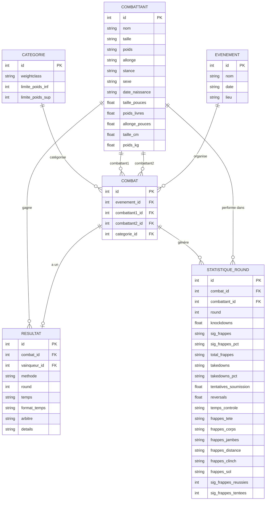

<h1 style="display: flex; align-items: center; gap: 10px;">
  
- Projet CS50 SQL
</h1>

## 📚 Contexte académique
> Ce projet a été réalisé dans le cadre de l'UE6 - Infrastructure de données (partie SQL) du Master 1 Analyse et Politique Economique, Parcours **Data science pour l'économie et l'entreprise du futur** (DS2E).

## 💡 Présentation du projet
Dans ce projet, nous avons construit un **système complet de gestion de données** autour de l'univers de l'UFC (Ultimate Fighting Championship), combinant à la fois :
- Les aspects sportifs (résultats, statistiques)
- Les données biométriques des athlètes
- Les informations événementielles

Notre travail consiste à **modéliser puis implémenter une base de données relationnelle SQL** qui retrace :
- Le parcours des combattants
- Leurs performances techniques
- Les événements majeurs de l'organisation
- Des données détaillées comme les statistiques par round, les méthodes de victoire et les caractéristiques physiques

Ce système permet non seulement d'**archiver les informations historiques** des combats UFC, mais aussi d'**effectuer des analyses statistiques avancées** sur les performances et les tendances de ce sport en pleine expansion.

## 📋 Table des matières
- [Objectifs du projet](#objectifs-du-projet)
- [Structure de la base de données](#structure-de-la-base-de-données)
- [Diagramme Entité-Relation](#diagramme-entité-relation)
- [Fonctionnalités principales](#fonctionnalités-principales)
- [Contenu des fichiers](#contenu-des-fichiers)
- [Installation et utilisation](#installation-et-utilisation)
- [Exemples de requêtes](#exemples-de-requêtes)
- [Sources des données](#sources-des-données)
- [Optimisations et limitations](#optimisations-et-limitations)

## 🎯 Objectifs du projet

L'objectif principal est de créer un système complet de gestion de données autour de l'UFC qui permet de :

- Stocker et gérer les informations sur les combattants (caractéristiques physiques, palmarès)
- Enregistrer les événements UFC et leur localisation
- Suivre les résultats détaillés des combats
- Analyser les statistiques de performance par round et par combattant
- Classifier les combattants par catégories de poids
- Fournir des vues analytiques pour les requêtes fréquentes

Ce projet vise également à appliquer concrètement les enseignements reçus lors de nos cours. Il représente une synthèse pratique de nos connaissances théoriques en SQL.

## 🏗️ Structure de la base de données

La base de données est structurée autour de six tables principales et trois vues optimisées :

### Tables principales
1. **CATEGORIE** - Catégories de poids des combattants
2. **COMBATTANT** - Informations sur les athlètes
3. **EVENEMENT** - Détails des événements UFC
4. **COMBAT** - Association entre événements et combattants
5. **RESULTAT** - Résultats des combats
6. **STATISTIQUE_ROUND** - Statistiques détaillées par round et par combattant

### Vues analytiques
1. **VUE_PALMARES** - Récapitulatif des victoires/défaites par combattant
2. **VUE_STATS_COMBATTANT** - Statistiques agrégées par combattant
3. **VUE_DETAILS_COMBAT** - Vue complète des combats avec leurs résultats

## 📊 Diagramme Entité-Relation



## ✨ Fonctionnalités principales

La base de données UFC offre les fonctionnalités suivantes :

- **Suivi complet des combattants** : Stockage des informations biométriques avec conversion automatique entre unités impériales (pouces, livres) et métriques (cm, kg)
- **Gestion des événements** : Organisation hiérarchique des événements avec date et lieu
- **Analyse détaillée des combats** : Statistiques complètes par round incluant frappes, takedowns, soumissions
- **Catégorisation automatique** : Association des combats aux catégories de poids appropriées
- **Vues prédéfinies** : Accès facile aux statistiques et résultats les plus recherchés
- **Optimisation des performances** : Index sur les colonnes fréquemment utilisées
- **Intégrité des données** : Triggers pour garantir la cohérence des données (ex: poids des combattants vs catégorie)

## 📁 Contenu des fichiers

Ce projet est composé des fichiers suivants :

- [**schema.sql**](schema.sql) : Script de création du schéma de la base de données
- [**import.sql**](import.sql) : Script d'importation des données depuis les fichiers CSV
- [**queries.sql**](import.sql) : Exemples de requêtes démontrant les capacités de la base de données
- [**ufc.db**](ufc.db) : Base de données SQLite complète avec le schéma et les données déjà importées
- [**README.md**](README.md) : Ce document de conception et de documentation

### Fichiers de données (format CSV) :

- [**catégories.csv**](CSV/catégories.csv) : Liste des catégories de poids UFC
- [**TOTT.csv**](CSV/TOTT.csv) : Données sur les combattants (TOTT = "Tale of the Tape", terme utilisé à l'UFC pour désigner les statistiques comparatives des combattants avant un combat)
- [**evenements.csv**](CSV/evenements.csv) : Liste des événements UFC
- [**combats.csv**](CSV/combats.csv) : Associations des combattants aux événements
- [**Résultats_combats.csv**](CSV/Résultats_combats.csv) : Résultats détaillés des combats
- [**Statistiques_combats.csv**](CSV/Statistiques_combats.csv) : Statistiques par round

## 🚀 Installation et utilisation

Pour mettre en place et utiliser cette base de données UFC, suivez les étapes ci-dessous :

### Configuration initiale

1. **Création du schéma** : Commencez par exécuter le script de création du schéma qui définit la structure de la base de données
   ```bash
   sqlite3 ufc.db < schema.sql
   ```
   Ce script crée toutes les tables nécessaires, les vues analytiques, les index pour l'optimisation des performances ainsi que les triggers pour assurer l'intégrité des données.

2. **Importation des données** : Une fois le schéma créé, importez les données depuis les fichiers CSV
   ```bash
   sqlite3 ufc.db < import.sql
   ```
   Cette étape remplit les tables avec toutes les informations sur les combattants, événements, combats, résultats et statistiques.

### Utilisation de la base de données

Une fois la base de données configurée, vous pouvez :

- **Explorer la structure** :
  ```bash
  sqlite3 ufc.db
  .tables     # Affiche toutes les tables et vues
  .schema     # Affiche le schéma complet
  ```
  
- **Effectuer des analyses personnalisées** en vous connectant à la base :
  
  ```bash
  sqlite3 ufc.db
  ```
  Vous pouvez ensuite exécuter vos propres requêtes SQL pour analyser les données selon vos besoins.

### Visualisation web

  Pour une expérience plus conviviale, vous pouvez visualiser et interagir avec la base de données via une interface web :
  
  ```bash
  # Installation
  pip install sqlite-web

  # Lancement
  sqlite_web ufc.db
  ```
  Cette commande lance une interface web accessible via votre navigateur vous permettant de :
    - Naviguer facilement dans les tables et vues
    - Exécuter des requêtes SQL de manière interactive
    - Visualiser les données dans un format tabulaire
    - Explorer la structure de la base de données
  
## 📝 Exemples de requêtes

Notre base de données permet d'effectuer des analyses avancées sur les combats, combattants et statistiques de l'UFC. Vous trouverez dans le fichier [**queries.sql**](queries.sql) un ensemble complet de requêtes démontrant les capacités analytiques du système.

Voici quelques exemples représentatifs :

### 🥊 Top 5 des combattants ayant subi le plus de frappes
```sql
SELECT 
    cb.nom,
    SUM(sr.sig_frappes_reussies) AS coups_subis
FROM STATISTIQUE_ROUND sr
JOIN COMBATTANT cb ON cb.id = sr.combattant_id
GROUP BY cb.nom
ORDER BY coups_subis DESC
LIMIT 5;
```

### 🤼‍♂️ Spécialistes de la soumission
```sql
SELECT 
    cb.nom,
    COUNT(*) AS nb_soumissions
FROM RESULTAT r
JOIN COMBATTANT cb ON r.vainqueur_id = cb.id
WHERE methode LIKE '%Submission%'
GROUP BY cb.nom
ORDER BY nb_soumissions DESC
LIMIT 10;
```

### 🔄 Analyse des rematches
```sql
WITH combats_entre_memes_combattants AS (
    SELECT 
        CASE WHEN c.combattant1_id < c.combattant2_id 
             THEN c.combattant1_id ELSE c.combattant2_id END AS combattant_a,
        CASE WHEN c.combattant1_id < c.combattant2_id 
             THEN c.combattant2_id ELSE c.combattant1_id END AS combattant_b,
        c.id AS combat_id,
        e.date,
        r.vainqueur_id,
        ROW_NUMBER() OVER (
            PARTITION BY 
                CASE WHEN c.combattant1_id < c.combattant2_id THEN c.combattant1_id ELSE c.combattant2_id END,
                CASE WHEN c.combattant1_id < c.combattant2_id THEN c.combattant2_id ELSE c.combattant1_id END
            ORDER BY e.date
        ) AS numero_combat
    FROM COMBAT c
    JOIN EVENEMENT e ON c.evenement_id = e.id
    JOIN RESULTAT r ON r.combat_id = c.id
    WHERE r.vainqueur_id IS NOT NULL
)
SELECT 
    cb1.nom AS combattant_a,
    cb2.nom AS combattant_b,
    COUNT(*) AS nombre_confrontations,
    STRING_AGG(
        CASE 
            WHEN c.vainqueur_id = c.combattant_a THEN cb1.nom
            ELSE cb2.nom
        END, 
        ', ' 
        ORDER BY c.numero_combat
    ) AS sequence_vainqueurs
FROM combats_entre_memes_combattants c
JOIN COMBATTANT cb1 ON c.combattant_a = cb1.id
JOIN COMBATTANT cb2 ON c.combattant_b = cb2.id
GROUP BY c.combattant_a, c.combattant_b
HAVING COUNT(*) > 1
ORDER BY nombre_confrontations DESC, cb1.nom, cb2.nom;
```

### 👨‍⚖️ Statistiques des arbitres
```sql
SELECT 
    r.arbitre,
    COUNT(*) AS total_combats,
    COUNT(CASE WHEN r.methode LIKE '%Decision%' THEN 1 END) AS decisions,
    COUNT(CASE WHEN r.methode LIKE '%KO%' OR r.methode LIKE '%TKO%' THEN 1 END) AS ko_tko,
    COUNT(CASE WHEN r.methode LIKE '%Submission%' THEN 1 END) AS soumissions,
    ROUND(100.0 * COUNT(CASE WHEN r.methode LIKE '%Decision%' THEN 1 END) / COUNT(*), 2) AS pct_decisions,
    ROUND(100.0 * COUNT(CASE WHEN r.methode LIKE '%KO%' OR r.methode LIKE '%TKO%' THEN 1 END) / COUNT(*), 2) AS pct_ko_tko,
    ROUND(100.0 * COUNT(CASE WHEN r.methode LIKE '%Submission%' THEN 1 END) / COUNT(*), 2) AS pct_soumissions
FROM RESULTAT r
WHERE r.arbitre IS NOT NULL AND r.arbitre != ''
GROUP BY r.arbitre
HAVING total_combats >= 10
ORDER BY total_combats DESC;
```

### 📥 Exemple d'insertion complète

Le fichier inclut également un exemple pratique d'ajout d'un événement complet dans la base de données :

- **UFC Strasbourg** (11 avril 2026)
- **Deux combats** avec combattants fictifs français (Arnaud Kindbeiter, Hugo Schneider) et réels (Volkanovski vs Holloway)
- **Résultats** : Soumission au round 2 et décision unanime
- **Statistiques détaillées** : Frappes significatives, takedowns, temps de contrôle par round
- **Nettoyage automatique** : Suppression complète des données après démonstration

Cet exemple illustre l'insertion de données interconnectées en respectant les contraintes d'intégrité référentielle.

Pour découvrir d'autres exemples et exploiter pleinement les capacités de notre système, consultez le fichier [**queries.sql**](queries.sql).

## 📊 Sources des données

Les données utilisées dans ce projet proviennent des sources suivantes :

- [Scrape UFC Stats – Greco1899](https://github.com/Greco1899/scrape_ufc_stats) : La majorité des données ont été récupérées grâce à ce script Python de scraping qui collecte les données depuis [UFCStats.com](http://ufcstats.com/)
- [UFC.com](https://www.ufc.com/) – Références officielles (catégories, poids, événements)

## 🔧 Optimisations et limitations

### Optimisations

- **Colonnes générées** : Utilisation de colonnes générées pour les calculs fréquents
- **Index stratégiques** : Index sur les jointures et conditions de filtrage courantes
- **Vues matérialisées** : Précalcul des agrégations courantes via des vues
- **Conversion d'unités** : Stockage à la fois des unités impériales et métriques
- **Triggers** : Validation automatique de la cohérence des données

### Limitations

- **Mises à jour en temps réel** : La base de données n'est pas conçue pour des mises à jour en direct pendant les événements
- **Normalisation vs performance** : Certaines tables, comme STATISTIQUE_ROUND, contiennent des données textuelles qui pourraient être davantage normalisées
- **Catégorisation automatique** : L'algorithme de correspondance des catégories de poids peut nécessiter des ajustements manuels dans certains cas
- **Données manquantes** : Certains combattants peuvent avoir des informations incomplètes (date de naissance, stance, etc.)
- **Correspondance des noms** : Des ajustements manuels ont été nécessaires pour faire correspondre les noms de combattants entre différentes sources de données

### Améliorations futures

- **Gestion native des "catch weight"** : Actuellement, notre système attribue les combats en "catch weight" (combats où les athlètes s'accordent sur un poids intermédiaire entre deux catégories officielles) à la catégorie existante la plus proche. Une amélioration future pourrait consister à créer une entité spécifique pour ces combats avec leur poids exact négocié, permettant une traçabilité plus précise de ces accords particuliers.

- **Historique des champions** : Implémentation d'un système de gestion des ceintures de champion par catégorie, incluant :
  - L'historique des champions par catégorie
  - Les défenses de titre
  - Les ceintures intérimaires
  - Les combats pour le titre
  
- **Hiérarchie des cartes d'événements** : Distinction entre les différentes parties d'un événement :
  - Main card (carte principale)
  - Preliminary card (preliminaries)
  - Early preliminaries
  
  Cette structure permettrait des analyses plus précises sur la progression des combattants dans la hiérarchie UFC

- **Gestion des surnoms et alias** : Ajout d'une table pour gérer les multiples identités des combattants :
  - Surnoms officiels (ex: "The Notorious" pour Conor McGregor)
  - Alias et variations orthographiques des noms
  - Noms d'avant/après mariages ou changements légaux
  
- **Autres améliorations potentielles** :
  - Gestion des blessures et annulations
  - Suivi des suspensions médicales post-combat
  - Intégration des bonus de performance (Fight of the Night, Performance of the Night)
  - Système de ranking officiel UFC
  - Gestion des contrats et statuts des combattants (actif, retraité, suspendu)

Ces améliorations permettraient d'avoir un système encore plus complet et fidèle à la complexité organisationnelle de l'UFC.

## 👨‍💻 Auteurs

Ce projet a été développé par :

- **Arnaud KINDBEITER** - [GitHub @arnaudkdbtr](https://github.com/arnaudkdbtr)
- **Hugo Schneider** - [GitHub @HugoSchneider](https://github.com/HugoSchneider)
